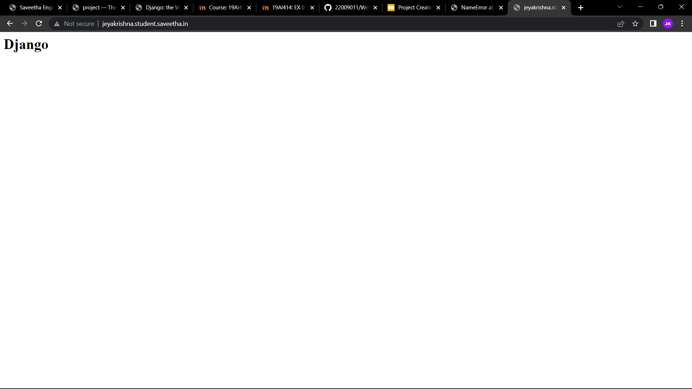
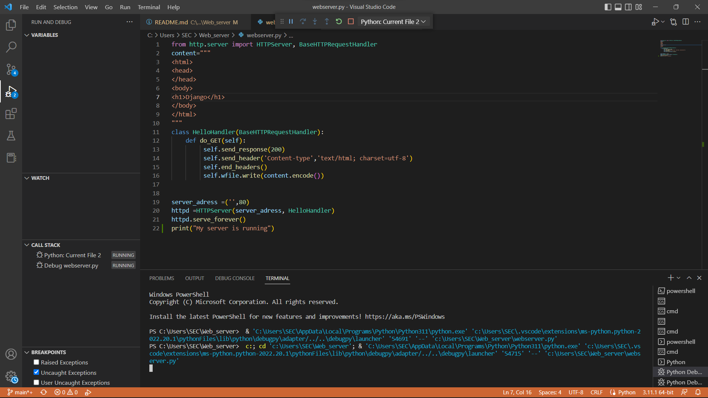

# Developing a Simple Webserver

# AIM:

To Display Three Programming Language

# DESIGN STEPS:

## Step 1:

HTML content creation is done

## Step 2:

Design of webserver workflow

## Step 3:

Implementation using Python code

## Step 4:

Serving the HTML pages.

## Step 5:

Testing the webserver

# PROGRAM:
from http.server import HTTPServer, BaseHTTPRequestHandler

content ="""
<html>
<head>
</head>
<body>
<h1>DJANGO</h1>
</body>
</html>
"""

class HelloHandler(BaseHTTPRequestHandler):
    def do_GET(self):
        self.send_response(200)
        self.send_header('Content-type','text/html; charset=utf-8')
        self.end_headers()
        self.wfile.write(content.encode())

server_adress =('',80)
httpd =HTTPServer(server_adress, HelloHandler)
httpd.serve_forever()
print("My sever is running")

## OUTPUT:
### SERVER SIDE OUTPUT

### CLIENT SIDE OUTPUT

# RESULT:

The program is executed succesfully
